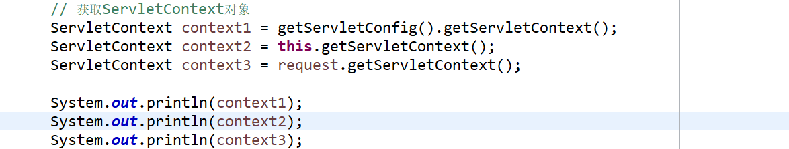
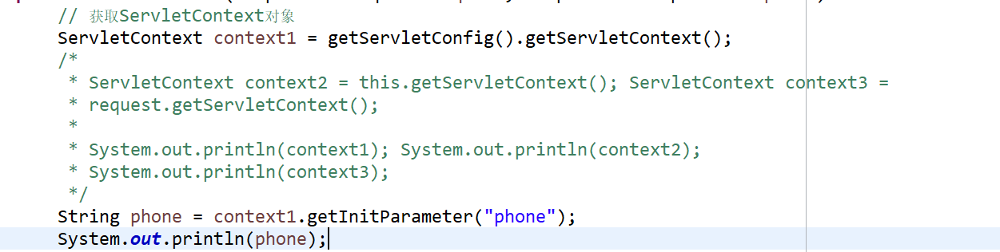
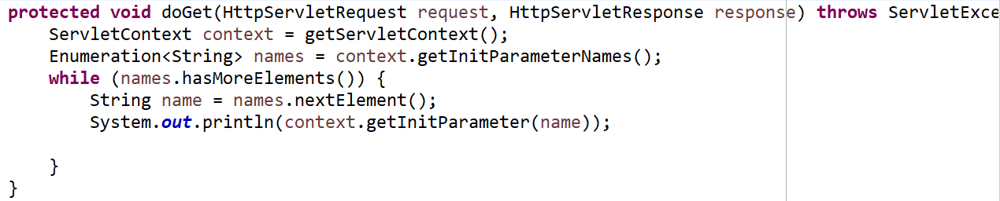

# Servlet

### 一、 回顾

> 运行在服务器端的java程序。server applet,能够在服务器端帮助应用接收和处理请求，并做出响应。
>
> 请求：
>
> ​		ServletRequest:
>
> 响应：
>
> ​		ServletResponse:
>
> ​      响应数据：
>
> ​		字符流响应：
>
> ​			PrintWriter out=response.getWriter();
>
> ​			out.write("Hello World");
>
> ​		字节流响应：
>
> ​			OutputStream out=response.getOutputStream();
>
> ​			out.write("Hello World".getBytes());
>
> ​	  响应页面：
>
> ​			分为两类：
>
> ​				**请求转发：**
>
> ​				响应重定向：
>
> ​					response.sendRedirect("xxx.html");

> 乱码：
>
> ​	请求乱码：
>
> ​		request.getParamter("name");//字符串
>
>    请求方式乱码：GET/POST
>
> ​	Tomcat1.7+ 版本自动解决请求的GET乱码。 
>
> ​	Tomcat1.7- GET请求参数是乱码的，在Tomcat的server.xml文件中，Connecter标签上加上编码。
>
> ​	URLEncoding="GBK"
>
> GET方式解决乱码：
>
> ​		利用字符串的重组（使用字节重组）
>
> ​		String name="大家好！";
>
> ​		byte[] b=name.getBytes("ISO-8859-1");
>
> ​		name=new String(b,"UTF-8");
>
> POST请求乱码：
>
> ​		request.setCharacterEncoding("UTF-8");
>
> ​		

### 二、 Servlet中的对象：

#### 2.1 ServletConfig对象

> 表示一个servlet在创建时的配置信息。可以通过这个对象获取配置参数。每个Servlet都可以有自己的配置信息。配置信息需要在配置Servlet映射时在web.xml文件中进行配置。

##### 2.1.1 如何获取对象

> 1： 可以通过某个Servlet的初始化方法中的形参直接获取到ServletConfig对象。
>
> 2： 通过当前Servlet类的对象调用getServletConfig()方法来进行获取对象。

##### 2.1.2 Config对象的使用

> 使用ServletConfig的目的是为了获取servlet的配置信息。
>
> 需要有配置信息。

在web.xml文件中准备配置信息

```xml
  <servlet>
  	<servlet-name>ServletDemo</servlet-name>
  	<servlet-class>com.qfcast.cn.ServletDemo</servlet-class>
  	<!-- 准备当前Servlet的配置信息 -->
  	<init-param>
  		<param-name>userName</param-name>
  		<param-value>zhangsan</param-value>
  	</init-param>
  	<init-param>
  		<param-name>userAddress</param-name>
  		<param-value>安徽省合肥市包河区</param-value>
  	</init-param>
  	<init-param>
  		<param-name>userAge</param-name>
  		<param-value>25</param-value>
  	</init-param>
  </servlet>
```

在当前Servlet中获取配置信息

常用方法及使用：

```java
getInitParameter(String name);获取指定名称的配置信息
getInitParameterNames();获取所有配置信息的名称
```

```java
		ServletConfig config = getServletConfig();
		String userName = config.getInitParameter("userName");
		String userAddress = config.getInitParameter("userAddress");
		//当配置信息过多时，使用这种方式就比较的麻烦，可以一次性的获取到所有配置信息的name，在配置着循环获取所有信息
		Enumeration<String> names = config.getInitParameterNames();
		while (names.hasMoreElements()) {
			String name =  names.nextElement();
			String value = config.getInitParameter(name);
			System.out.println(value);
		}
```


#### 2.2 ServletContext对象

> 表示是当前整个项目，在一个项目中有且仅有一个ServletContext.只要能获取到这个对象，就可以在任意地方使用这个对象。
>
> ServletContext的创建时机：项目搭建到服务器后服务器启动时创建。服务器关闭时销毁这个对象---->生命周期
>
> 同时ServletContext也是JavaWeb的三大域对象之一。

##### 2.2.1 域对象

> 所谓的域对象，就是有一个对象，内容封装了一个Map集合，可以向这个Map集合中存储数据和从这个Map集合中获取数据。
>
> 特点：
>
>   1. 生命周期，决定了当前域对象中存储的数据的使用范围。
>
>   2. 域对象的使用，
>
>      获取数据： getAttribute(String name);
>
>      存储数据：setAttribute(String name,Object value);
>
>      删除数据： removeAttribute(String name);

##### 2.2.2 如何获取Context对象

> 1： 通过ServletConfig对象中的getServletContext()方法来回去ServletContext对象
>
> ​		config.getServletContext();
>
> 2:	通过当前Servlet的对象中的getServletContext()方法来回去ServletContext对象
>
> ​		servlet.getServletContext();
>
> 3:	通过请求对象中的getServletContext()方法来回去ServletContext对象
>
> ​	  request.getServletContext();



##### 2.2.3 获取整个应用的配置信息

> ServletContext表示整个应用的上下文，所以可以通过这个对象获取整个应用的配置信息。获取方式与ServletConfig一模一样。
>
> 先准备配置信息。在web.xml中
>
> ```xml
>   <!--  设置整个应用的配置信息 -->
>   <context-param>
>   	<param-name>phone</param-name>
>   	<param-value>13838384388</param-value>
>   </context-param>
>   <context-param>
>   	<param-name>email</param-name>
>   	<param-value>13838384388@163.com</param-value>
>   </context-param>
>   <context-param>
>   	<param-name>personName</param-name>
>   	<param-value>李四</param-value>
>   </context-param>
> ```

```java
getInitParameter(String name);获取指定名称的配置信息
getInitParameterNames();获取所有配置信息的名称
```





##### 2.2.4 作为域对象存储删值（`重点`）

> ServletContext可以存储值，可以在项目中的任意地方获取这个对象中的值，前提是你能够取到这个对象。值存储在这个域对象中后如果不删除，一直会存放到服务器关闭位置。

存值：

```java
		ServletContext context = getServletContext();
		context.setAttribute("userName", "赵云");
		context.setAttribute("userAge", 20);
		User u=new User();
		u.setUserName("马超");
		u.setUserAge(21);
		u.setUserSex("man");
		context.setAttribute("user", u);
```

取值：

```java
		ServletContext context = getServletContext();
		System.out.println(context.getAttribute("userName"));
		System.out.println(context.getAttribute("userAge"));
		System.out.println(context.getAttribute("user"));
		User user = (User)context.getAttribute("user");
		System.out.println(user.getUserSex());
```

删除值：

```java
		ServletContext context = getServletContext();
		context.removeAttribute("userName");
```

#### 2.3 HttpServletRequest对象

> 表示一个请求，这个对象中包含了所有的请求信息，请求头，请求体。可以通过这个对象获取所有请求信息。

常用方法：

```java
//获取请求信息        
System.out.println(request.getParameter("userName"));
System.out.println(request.getParameter("userPwd")); 
// 获取GET请求的请求参数字符串
System.out.println(request.getQueryString());
// 获取URI
System.out.println(request.getRequestURI());
//获取URL
System.out.println(request.getRequestURL().toString());
```

##### 2.3.1 POST请求参数中文乱码

> 在开发过程中POST请求比较常见，但是如果使用post请求发送信息，后端java代码在获取这些信息时就会出现中文乱码问题，因此需要解决这个问题。

> 请求乱码的原因是：
>
> ​	post请求是将请求信息放在请求体中，在网络传输过程中会对当前的请求体简写编码。到后台时需要进行解码。默认情况下后端解码请求体使用的是ISO-8859-1表解码的，而汉字编码不是用这个码表用GBK或者UTF-8系列表。因此无法正常解码。所以要告诉后台使用什么码表解码。

```java
        // 设置请求编码方式
        request.setCharacterEncoding("UTF-8");
        System.out.println(request.getParameter("userName"));
        System.out.println(request.getParameter("userPwd"));
```

**注意：以后在写Servlet时，第一件事就是先写解决乱码问题**

##### 2.3.2 请求转发forward

> 当一个请求到达servlet，如果这个servlet没有这个能力来帮助处理当前这个请求，此时这个servlet可以选择将当前的请求转发到其它的地方（页面或者servlet），让其他的页面帮助解决当前的请求。
>
> A将请求发送给B,B没有能力解决将请求转发给了C，C解决了当前的请求并做出响应，C将响应给B，B在将响应给A。
>
> A 认为结果是B处理的，其实结果是C处理的。响应的结果是C的内容，请求的地址是B的地址。

```java
// 请求转发
// 参数： 具体要转发到哪里
RequestDispatcher dispatcher = request.getRequestDispatcher("home.jsp");
dispatcher.forward(request,response);
```

特点：

> 1. 请求转发的地址栏就是请求发送的地址。
> 2. 请求转发只发送一次请求。
> 3. 请求转发内容显示的是最后一个接收到转发的请求的地方的内容。
> 4. 请求转发不能将请求转发到域外地方。
> 5. 请求转发可以携带请求域对象中的值。

##### 2.3.3 请求域对象

> 请求对象也是Servlet三大域对象之一。
>
> 生命周期：
>
> ​		当一个请求发起到请求结束位置。
>
> 特点：
>
> ​		这个域对象中携带的内容只能在当前请求还没有结束的情况下能够使用，如果请求结束了，当前域对象中的内容将会不存在。如果想要将当前域对象中的内容携带到另一个页面，只能使用请求转发来转发当前的请求到另一个地方。

课堂练习：

​	完成用户登录功能（带数据库），登录页输入用户名和密码，进行登录，后台校验数据库，如果有当前的用户名并且密码也正确，跳转到首页，如果不正确，回到（跳转）登录页

#### 2.4 HttpServletResponse对象

> 响应对象，当servlet接收到请求后，需要给用户一个响应，这个对象就是表示响应的对象。该对象中包含了所有的响应信息。
>
> 响应信息分类：
>
> ​	响应数据：
>
> ​			通过流的方式将数据响应到浏览器中，
>
> ​	响应页面：
>
> ​			响应重定向

##### 2.4.1 响应数据

> 响应数据是通过流进行响应的，流又分为字节流和字符流。所以响应数据可以通过这两种类型的流进行操作。
>
> **注意：字节流和字符流不能同时使用，否则只会执行第一个开启的流**

###### 2.4.1.1 字节流响应数据

```java
// 获取到响应字节流
ServletOutputStream out = response.getOutputStream();
out.write("大家好，我是响应的数据".getBytes());
```

注意：字节流响应数据不会出现乱码的。

###### 2.4.1.2 字符流响应数据

```java
// 获取到响应字符流
PrintWriter w = response.getWriter();
w.write("我是字符流响应的数据");
```

**注意：字符流响应会出现乱码**

> 总结：
>
> ​	字节流响应与字符流响应数据其实运用的地方都很多，但是不能混合使用。如果现在需要响应的是超文本文件，此时就需要使用字节流，如果是文本文件最好使用字符流。

##### 2.4.2 响应字符流乱码

> 响应字符流乱码：
>
> ​	其实是浏览器在接收响应信息时不知道用神马编码方式和神马格式来打开当前的信息，导致选择默认方式打开，无法正常显示内容。
>
> 解决办法：
>
> ​	在响应数据时，在响应头中设置一个头信息，这个头信息的作用就是告诉浏览器用神马编码和格式打开当前的响应信息即可。设置响应头Content-Type=text/html;charset=utf-8

```java
        // 设置响应头
       // response.setHeader("Content-Type","text/html;charset=UTF-8");
        // 直接设置内容类型
        response.setContentType("text/html;charset=UTF-8");
```

总结：以后在写Servlet开始就要解决乱码问题，需要解决请求和响应的乱码。

```java
request.setCharacterEncoding("UTF-8");
response.setContentType("text/html;charset=UTF-8");
```

##### 2.4.3 响应页面（响应重定向）

> 响应可以将页面返回给客户端。称为响应重定向。
>
> 使用sendRedirect()进行重定向

特点：

> 1. 响应重定向的地址栏会发生变化。
> 2. 响应重定向发送两次请求。
> 3. 响应重定向可以访问跨域地址

